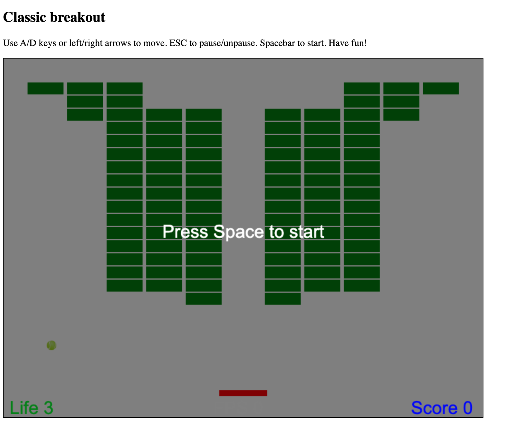

## Introduction

This directory implements the classic `breakout` game with pure vanilla Javascript (no external dependencies)
using a `canvas` element.

## Quick Start

For quick local testing and playing you can run:

    $ ./serve.sh

This will create a simple python web server to provide access to `index.html` to a web browser

On the same machine, open the following path on a web browser:

    http://localhost:8000

Enjoy!

